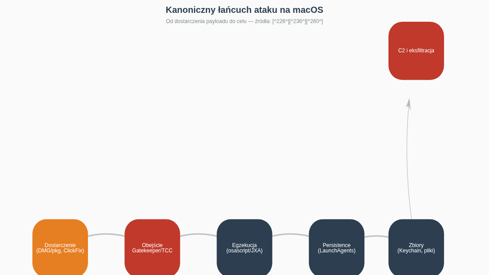
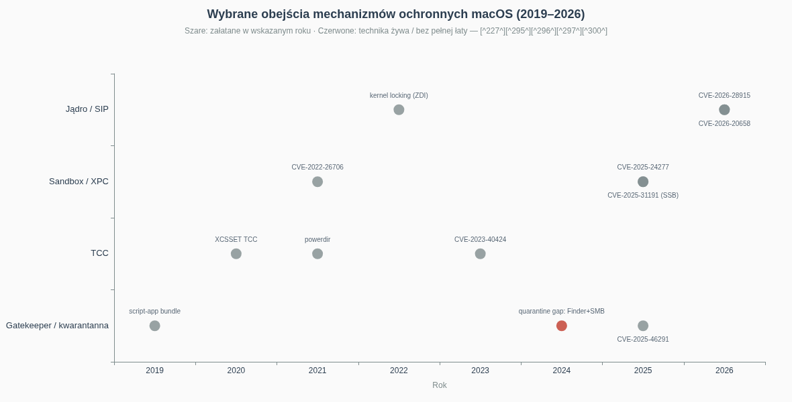
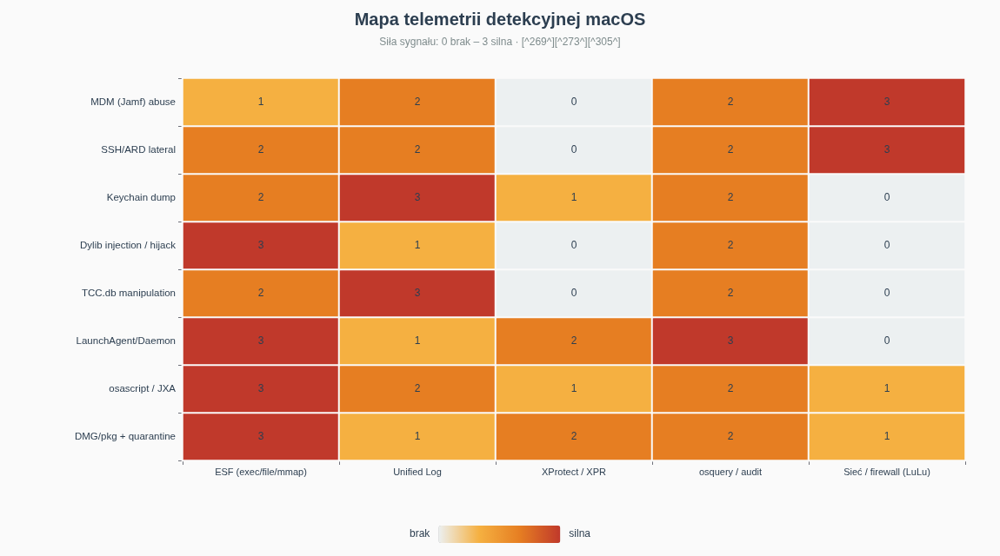
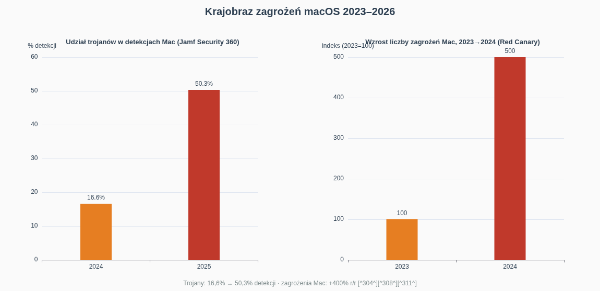

# Red Team na macOS — kompendium technik ofensywnych i detekcji

**Typ dokumentu:** kompendium techniczne (deep research) · **Język:** polski · **Zakres:** macOS 13 Ventura – macOS 26 Tahoe (Apple Silicon i Intel) · **Perspektywa:** Red Team z kontrapunktem Blue Team · **Data:** sierpień 2026

> **Wydanie siostrzane:** ten dokument jest trzecią częścią cyklu — po „Red Team na Linux" i „Red Team na Windows". Zachowuje identyczną architekturę: mapowanie na MITRE ATT&CK, scenariusze krok po kroku, tabele porównawcze oraz sekcje detekcji dla obrońców.

---

## Streszczenie wykonawcze

macOS przestał być „bezpieczną enklawą" i stał się w pełni dojrzałym polem walki: według raportu Jamf Security 360 (2026) rynek komputerów Mac urósł o 16,4%, a **44% komputerów Mac odnotowało w 2025 roku kontakt ze złośliwym ruchem sieciowym** [^304^]. Ekonomia zagrożenia zmieniła się fundamentalnie: malware typu stealer (Atomic macOS Stealer, Poseidon, Odyssey) jest sprzedawany w modelu MaaS za 1000–3000 USD miesięcznie, a sam Poseidon odpowiadał w połowie 2025 roku za około **70% wszystkich aktywnych infekcji na macOS** [^255^] [^308^]. Liczba nowych rodzin malware'u na macOS wzrosła z 2023 do 2024 roku o około **400%**, a udział trojanów wśród detekcji skoczył z 16,6% do 50,3% w ciągu jednego roku [^253^] [^304^].

Trzy wnioski strategiczne dla zespołów ofensywnych i defensywnych:

1. **Peryferia są martwe — socjotechnika żyje.** Prawdziwe kampanie nie uderzają w XNU od zewnątrz, lecz przechodzą przez użytkownika: fałszywe aktualizacje przeglądarki, malvertising i taktyka ClickFix, w której ofiara sama wkleja jednolinijkowego `curl | zsh` do Terminala — metoda ta jest dziś używana zarówno przez cyberprzestępców (AMOS, Odyssey), jak i przez operatorów państwowych z Korei Północnej (BeaverTail/InvisibleFerret) [^280^] [^284^].
2. **TCC, nie kernel, jest środkiem ciężkości.** Najciekawsze operacje na macOS to nie eksploity jądra, lecz łańcuchy obejść Transparency, Consent and Control: od uprawnienia Accessibility, przez EndpointSecurityClient, po Full Disk Access — i dalej do Keychain. Apple w macOS 27 planuje wręcz rozszerzyć TCC o nowe usługi (SysAdminFiles, NFSHomeDirectory) i zastąpić część starych uprawnień nowymi kategoriami [^251^] [^240^].
3. **Detekcja istnieje i jest niedoceniana.** Endpoint Security Framework emituje ponad sto typów zdarzeń (exec, mmap, fork, signal, a od macOS 26.4 również niskopoziomowe zdarzenia gniazd), XProtect Remediator działa jako aktywny skaner behawioralny, a społeczność dostarcza gotowe reguły (Elastic, SigmaHQ, coreSigma) — problemem nie jest brak telemetrii, lecz brak jej odbiorców [^273^] [^270^] [^305^] [^269^].

Najważniejsze techniki zawarte w tym kompendium, w kolejności łańcucha ataku: omijanie kwarantanny Gatekeepera (w tym „żywa" luka związana z pobieraniem przez Finder/SMB), inżynieria DMG/pkg i ClickFix, enumeracja przez JXA/osascript, eskalacja przez TCC i SUID, persistence w LaunchAgents/Daemons (i egzotycznych: emond, periodic, login hooks, overrides.plist), wstrzykiwanie i porwanie dylib, eksfiltracja Keychain, ruch boczny przez SSH/ARD/Remote Apple Events oraz nadużycia MDM (Jamf jako C2), a na koniec C2 w Mythic (Apfell, Poseidon) i Sliver/MacC2 [^226^] [^239^] [^258^] [^250^] [^294^] [^267^] [^78^].

---

## Zastrzeżenie prawne i etyczne

**Wyłącznie do użytku w autoryzowanych testach bezpieczeństwa.** Wszystkie techniki opisane w tym dokumencie służą edukacji, pracy red teamów z formalnym mandatem, treningowi obrońców i budowie detekcji. Wykorzystanie ich przeciwko systemom bez wyraźnej, pisemnej zgody właściciela jest przestępstwem — w Polsce m.in. z art. 267–269b Kodeksu karnego (nieuprawniony dostęp, podsłuch, zniszczenie danych, narzędzia do ataków), a w USA z Computer Fraud and Abuse Act. Charakterystyczne dla macOS procedury — omijanie Gatekeepera i TCC, zrzuty Keychain, nadużywanie MDM — mają szczególnie wysoką „gęstość prawną", bo część z nich (np. omijanie mechanizmów ochrony treści i zabezpieczeń technicznych) może naruszać także przepisy o ochronie praw autorskich. Autorzy i dystrybutorzy tego materiału nie ponoszą odpowiedzialności za nadużycia. **Zasada: brak pisemnej zgody = brak działania.**

---

## Spis treści

1. [Dlaczego macOS to osobna dyscyplina red teamowa](#1-dlaczego-macos-to-osobna-dyscyplina-red-teamowa)
2. [Dostęp początkowy: Gatekeeper, DMG/pkg i era ClickFix](#2-dostęp-początkowy-gatekeeper-dmgpkg-i-era-clickfix)
3. [Rekonesans i enumeracja: LOTL po apple'owemu](#3-rekonesans-i-enumeracja-lotl-po-appleowemu)
4. [Eskalacja uprawnień: od TCC po jądro XNU](#4-eskalacja-uprawnień-od-tcc-po-jądro-xnu)
5. [Persistence: siedemnaście sposobów na przetrwanie restartu](#5-persistence-siedemnaście-sposobów-na-przetrwanie-restartu)
6. [Unikanie detekcji: Gatekeeper, XProtect i magia dyld](#6-unikanie-detekcji-gatekeeper-xprotect-i-magia-dyld)
7. [Dostęp do poświadczeń: Keychain jako skarbiec](#7-dostęp-do-poświadczeń-keychain-jako-skarbiec)
8. [Ruch boczny: SSH, ARD i nadużycia MDM](#8-ruch-boczny-ssh-ard-i-nadużycia-mdm)
9. [Command and Control: Mythic, Poseidon, Sliver, MDM-as-C2](#9-command-and-control-mythic-poseidon-sliver-mdm-as-c2)
10. [Działania na celu: od stealerów po operacje ukierunkowane](#10-działania-na-celu-od-stealerów-po-operacje-ukierunkowane)
11. [Kontrapunkt Blue Team: telemetria i detekcje](#11-kontrapunkt-blue-team-telemetria-i-detekcje)
12. [Krajobraz zagrożeń 2024–2026](#12-krajobraz-zagrożeń-20242026)
13. [Ścieżka rozwoju i laboratorium](#13-ścieżka-rozwoju-i-laboratorium)
14. [Zakończenie](#14-zakończenie)

---

## 1. Dlaczego macOS to osobna dyscyplina red teamowa

Red teamer przyzwyczajony do Windowsa lub Linuksa, siadając do Maca, traci niemal cały arsenał intuicji. Nie ma Rejestru, zamiast niego jest sieć plistów, defaults i baz sqlite TCC. Nie ma ETW — jest Endpoint Security Framework i Unified Log. Zamiast `CreateRemoteThread` jest `DYLD_INSERT_LIBRARIES` i task porty. Zamiast `rundll32` — `osascript`. Sam system operacyjny to hybryda: jądro XNU (Mach + BSD), menedżer uruchamiania `launchd` (init, cron, inetd i watcher w jednym), a do tego stos zabezpieczeń własnych Apple'a: SIP (System Integrity Protection) chroniący ścieżki systemowe nawet przed rootem, Gatekeeper z notaryzacją, piaskownica aplikacji z Mac App Store i wspomniane TCC.

Typowy łańcuch ataku na macOS w 2025–2026 roku wygląda następująco:

*Rys. 1. Łańcuch ataku na macOS — od dystrybucji (DMG, pkg, ClickFix) do C2, z oznaczonymi punktami, w których działają mechanizmy Apple'a (źródła: [^226^] [^236^] [^260^]).*

Kluczowe różnice doktrynalne względem innych platform:

**1. Użytkownik jest perymetrem.** Ponieważ zewnętrzna powierzchnia ataku na Maca jest niewielka (domyślnie brak nasłuchujących usług poza mDNS/Bonjour), niemal cała ekosystemowa przestępczość zaczyna się od dostarczenia czegoś użytkownikowi: obrazu DMG z fałszywym „instalatorem", pakietu pkg, archiwum z malvertisingu albo komendy do wklejenia. Kampanie Poseidon Stealer dystrybuowano m.in. przez malvertising podszywający się pod pobieranie przeglądarki Arc [^308^] [^252^].

**2. TCC jest „UAC na sterydach" — i jego obejścia są walutą twardą.** Dostęp do Documents, Desktop, kamery, mikrofonu, nagrywania ekranu, a nade wszystko Full Disk Access — wszystko przechodzi przez bazy TCC.db (`~/Library/Application Support/com.apple.TCC/TCC.db` oraz `/Library/Application Support/com.apple.TCC/TCC.db`). Analizy takie jak „A deep dive into macOS TCC" (csandlin.io, styczeń 2026) pokazują, że uprawnienia da się lawirowo przekuwać jedno w drugie: np. `kTCCServiceSystemPolicySysAdminFiles` daje pełny dostęp do NFSHomeDirectory użytkownika, a bycie EndpointSecurityClient pozwala czytać pliki dowolnych procesów [^251^]. Apple odpowiada eskalacją: w zapowiadanym macOS 27 katalogi w `/Library` objęte dziś FDA mają wymagać osobnych, granularnych uprawnień, a część starych kategorii (w tym Accessibility jako brama do FDA) zostanie zastąpiona nowymi [^240^].

**3. „Bezpieczeństwo przez niepopularność" wygasło.** Wzrost liczby rodzin malware'u o ~400% (2023→2024) i fakt, że 44% Maców w badanej populacji Jamf dotknęło złośliwego ruchu w 2025 r., kończą erę, w której macOS był celem drugiego planu [^253^] [^304^]. Korea Północna traktuje Maca jako cel pierwszoplanowy: kampanie Contagious Interview rozwijane od 2023 roku używają natywnych implantów macOS (BeaverTail jako aplikacja Qt, InvisibleFerret w Pythonie) i docierają przez fałszywe rekrutacje do programistów — w tym wariant ClickFix z wklejaniem komendy [^279^] [^284^].

**4. Zarządzanie flotą (MDM) jest jednocześnie największym wektorem i największą ślepą plamą.** W środowiskach korporacyjnych Maci zarządza Jamf, Kandji czy Intune. Kto kontroluje MDM, kontroluje flotę — może wypychać profile konfiguracyjne (które same w sobie są mechanizmem persistence), pakiety pkg i skrypty z kontekstem roota. Raporty branżowe i porównania EDR wskazują nadużycia narzędzi zdalnej administracji i MDM jako wciąż słabo monitorowany wektor — w praktyce ta ścieżka bywa przez zespoły bezpieczeństwa wyłączona z podejrzeń [^311^] [^294^].

Dla czytelnika przechodzącego z wcześniejszych części cyklu: wiele nazw własnych się powtórzy (ATT&CK, SIGMA, osquery, MITRE), ale niemal żadna konkretna technika nie przenosi się 1:1. To właśnie czyni macOS osobną specjalizacją — potwierdza to fakt, że SpecterOps utrzymał dedykowany kurs „Adversary Tactics: Mac Tradecraft", a konferencja Objective by the Sea istnieje wyłącznie wokół bezpieczeństwa Apple [^286^] [^267^].

---

## 2. Dostęp początkowy: Gatekeeper, DMG/pkg i era ClickFix

### 2.1 Anatomia pierwszego przejścia

Gatekeeper egzekwuje trzy warstwy: atrybut kwarantanny (`com.apple.quarantine`), weryfikację podpisu i notaryzacji Apple, oraz — od Sequoii — wymuszoną decyzję użytkownika przez Ustawienia Systemowe. Red team musi zatem odpowiedzieć na pytanie: **jak sprawić, by payload w ogóle nie dostał etykiety kwarantanny, albo by użytkownik sam ją zdjął?**

Trzy realne klasy odpowiedzi:

**A. Łuki kwarantanny w mechanizmach pobierania.** Atrybut `com.apple.quarantine` nadaje proces, który *pisze* plik — nie ten, który go uruchamia. Historycznie Finder ustawiał kwarantannę dla plików pobranych z SMB przez „Połącz z serwerem", ale analizy pokazały luki w tym łańcuchu: pliki kopiowane z udziału SMB mogły trafiać na dysk bez atrybutu, co otwierało drogę do uruchomienia nieznotaryzowanej aplikacji bez promptu [^226^]. Świeższy przykład to **CVE-2025-46291** — błąd w obsłudze kwarantanny załatany w 2025 roku, pokazujący, że sam stos „pobierz → oznacz → zweryfikuj" nadal generuje podatności klasy Gatekeeper-bypass [^227^].

**B. Zmiana interfejsu ≠ zmiana modelu.** W macOS 15 Sequoia Apple usunął słynne „Control-klik → Otwórz" jako metodę obejścia Gatekeepera dla nieznotaryzowanego oprogramowania — użytkownik musi przejść przez Ustawienia Systemowe → Prywatność i ochrona [^232^]. To podniosło koszt klasy „przekonaj użytkownika do dwukliku", ale nie zamknęło jej: kampanie po prostu migrowały do instrukcji wieloetapowych (screenshoty w DMG prowadzące użytkownika za rękę) i do ClickFix.

**C. ClickFix: użytkownik jako downloader i loader.** Zamiast walczyć z Gatekeeperem, atakujący każą ofierze wykonać jego pracę: fałszywa strona („napraw problem z przeglądarką", „zweryfikuj CAPTCHA") każe wkleić do Terminala jednolinijkowca typu `curl -s ... | zsh`. Kampanie ClickFix dystrybuujące stealery AMOS i Odyssey dokumentowano masowo w 2025 roku [^252^] [^279^]; Palo Alto Unit 42 przypisało analogiczną taktykę operatorom DPRK [^284^], a zespół bezpieczeństwa GitLab opisał północnokoreański malware na macOS dostarczany właśnie tą metodą [^280^]. Z punktu widzenia defensora to koszmar: egzekucja pochodzi z Terminala uruchomionego przez zaufanego użytkownika, więc Gatekeeper, kwarantanna i notaryzacja są w tej fazie **całkowicie obchodzone** — jedyna realna linia obrony to detekcja samej komendy (Unified Log, ESF `exec`, reguły na rodzicielstwo Terminal→curl→interpreter).

### 2.2 Tradycyjne nośniki: DMG, pkg, ZIP

- **DMG z treścią „przeciągnij do Applications"** — klasyka AMOS/Poseidon. Obraz zawiera ikonę-aplikację oraz alias folderu Applications; nowsze wersje dodają instrukcje obchodzenia Sequoii.
- **Pakiety pkg** — kluczowa przewaga: **skrypty preinstall/postinstall wykonują się jako root** podczas instalacji. Złośliwe pakiety pkg ze skryptami postinstall dokumentowano w kampaniach Poseidon [^308^] [^252^]. Dla red teamu pkg to jednocześnie wektor i mechanizm privesc/persistence w jednym.
- **Script-bundles w stylu Shlayer** — aplikacja-bundel, której „binarka" to skrypt shell; historycznie jeden z najskuteczniejszych tricków na oszukanie oczekiwań użytkownika i prostszych silników [^231^].
- **Malvertising i SEO-poisoning** — sponsorowane wyniki dla „Arc browser download", „Notion for Mac" itd. prowadzące do klonów stron z złośliwymi instalatorami [^308^] [^252^].

### 2.3 Scenariusz red teamowy (skrót)

1. OSINT floty: wersje macOS, MDM, EDR (patrz rozdz. 3).
2. Przygotowanie nośnika: podpisany ad-hoc DMG z payloadem JXA (Apfell) *lub* kampania ClickFix z domeną klonującą realne narzędzie używane w organizacji.
3. Dostarczenie: spear-phishing z linkiem, nie załącznikiem (bramki mailowe rzadko analizują DMG).
4. Egzekucja: osascript/JXA w pamięci → staging do pełnego agenta.
5. Punkt kontrolny blue teamu: korelacja ESF `exec` (Terminal/zsh → curl) z zapisem do `~/Library/LaunchAgents`.

---

## 3. Rekonesans i enumeracja: LOTL po apple'owemu

Po pierwszej egzekucji operator potrzebuje odpowiedzi na cztery pytania: *gdzie jestem* (host, użytkownik, domena/MDM), *co mogę* (TCC, sudo), *kto patrzy* (EDR/ESF), *dokąd dalej* (sieć, konta, klucze). macOS ma dla każdego z nich natywne narzędzie — cała enumeracja da się zrobić bez wgrywania binarek.

### 3.1 Mapa natywnych narzędzi (living off the orchard)

| Cel enumeracji | Natywne narzędzie / API | Uwagi dla red teamu | Detekcja (blue team) |
|---|---|---|---|
| Host, OS, sprzęt | `system_profiler SPSoftwareDataType SPNetworkDataType`, `sw_vers`, `uname -a` | Bardzo „głośny" w logach, ale powszechny też u adminów | reguła na częste `system_profiler` z nietypowego rodzica |
| Użytkownicy i grupy | `id`, `dscl . list /Users`, `dscacheutil -q group` | `dscl` to odpowiednik `net user` | zapytania `dscl` spoza kontekstu admina |
| Uprawnienia TCC | odczyt `TCC.db` (wymaga FDA) lub test empiryczny (np. próba odczytu `~/Documents`) | „sonda TCC" zostawia ślady w sandboxie | odczyt TCC.db przez nietypowy proces |
| Sudo | `sudo -n -l` | bezpieczne sprawdzenie bez hasła | zdarzenie sudo w logu |
| Procesy/EDR | `ps aux`, `launchctl list`, `es_event` (API), `log show` | szukać: Jamf, Kandji, CrowdStrike, SentinelOne, Microsoft Defender, Santa | — |
| Sieć | `arp -a`, `netstat -anv`, `lsof -i`, `scutil --dns` | topologia i sąsiedzi do ruchu bocznego | `lsof -i` z payloadu |
| Keychain (metadane) | `security list-keychains`, `security find-generic-password -l ...` | listing bez dumpu | wywołania `security` z agenta C2 |
| Apple Events / automation | `osascript -e 'tell application "Finder" to ...'` | też do phishingu wewnętrznego (TCC prompt) | ESF + TCC event na AED |

Kanonicznym zestawem „post-exploitation checklist" dla macOS jest **SwiftBelt** od Cedrica Owensa — skrypt bash/python zbierający w jednym przebiegu m.in. użytkowników, historię shelli, zawartość SSH, zainstalowane aplikacje, konfigurację sieci i dane przeglądarek [^289^]. W roli frameworka: moduły Apfell i Poseidon (Mythic) pokrywają większość tych kroków komendami agenta.

### 3.2 JXA/osascript jako język enumeracji

JavaScript for Automation (JXA) jest dla macOS tym, czym PowerShell dla Windows — interpreterem z pełnym dostępem do API systemu (przez most Objective-C), uruchamianym natywnie i bez dodatkowych zależności. Mythic/Apfell zbudował na nim cały agent: enumeracja, wykonywanie komend, download/upload — wszystko w pamięci procesu osascript [^267^] [^268^]. Dokumentacja Mythic opisuje też, jak JXA współgra z mostem ObjC do wywołań natywnych API (np. `$.NSFileManager`), co pozwala czytać pliki, listować katalogi i wykonywać binarki bez forkowania shella [^268^].

Implikacja obronna: detekcja nie może polegać na sygnaturach binarek, tylko na **rodzicielstwie i argumencie procesu** — np. reguły łapiące `osascript -l JavaScript -e` oraz `osascript` z rodzicem innym niż Finder/Terminal/MDM [^269^].

### 3.3 Co sprawdzić w MDM-owanym środowisku

W korporacji pierwszym pytaniem nie jest „jak dostać roota", tylko „kto nim już jest": agent MDM (Jamf, Kandji) działa z uprawnieniami roota i regularnie wykonuje skrypty. Enumeracja obejmuje: `/var/log/jamf.log`, `profiles status -type enrollment`, pliki konfiguracyjne agenta MDM, a przede wszystkim **zdobycie sekretów MDM** (patrz rozdz. 8) — bo to najkrótsza droga do floty [^294^].

---

## 4. Eskalacja uprawnień: od TCC po jądro XNU

Na macOS privesc ma dwa piętra: *piętro uprawnień POSIX* (użytkownik → root) i *piętro uprawnień Apple* (TCC: Accessibility → Screen Recording → EndpointSecurityClient → FDA → iCloud data). W praktyce operacyjnej piętro Apple jest cenniejsze — FDA otwiera Keychain i dane wszystkich aplikacji nawet bez roota.

### 4.1 Piętro POSIX

Klasyczne wektory przenoszą się z Linuksa niemal bez zmian: błędna konfiguracja sudo (`sudo -l`, reguły NOPASSWD), pliki SUID/SGID (choć SIP ogranicza ich liczbę), zapisywalne pliki uruchamiane przez launchd jako root, oraz środowisko instalatorów (pkg z postinstall). Seria „100 Days of Red Team" wymienia sudo i SUID jako pierwszorzędne wektory macOS privesc [^237^]. Uwaga specyficzna dla Maca: grupa `admin` ma szerokie możliwości (m.in. zapisy do `/Applications`), a wiele narzędzi deweloperskich instaluje helpery z podniesionymi uprawnieniami.

### 4.2 Piętro TCC: łańcuchy uprawnień

Najciekawsza ścieżka to *transmutacja uprawnień TCC*:

1. **Accessibility (kTCCServiceAccessibility)** — pozwala syntetyzować zdarzenia HID, czyli… klikać w dialogi TCC za użytkownika. Apple ograniczył to, ale historycznie był to standardowy most do FDA [^243^].
2. **EndpointSecurityClient** — proces z tym uprawnieniem może odczytywać pliki innych procesów, co csandlin.io wskazuje jako realną ścieżkę do eskalacji aż po FDA [^251^].
3. **SysAdminFiles / NFSHomeDirectory** — kierunek, w którym idzie Apple w macOS 27: granularne uprawnienia zastępujące monolityczne FDA [^240^] [^251^].
4. **Błędy w samym TCC** — CVE-2023-40424 pokazał obejście TCC przez manipulację środowiskiem procesu; malware XCSSET łączył obejścia TCC z persistence w launchd i kradzieżą danych przeglądarek [^243^] [^246^].

### 4.3 Sandbox escape i jądro

Gdy potrzebny jest prawdziwy root/SIP-bypass, scena CVE jest aktywna:

| Podatność | Rok | Klasa | Znaczenie operacyjne |
|---|---|---|---|
| CVE-2025-24277 (osanalyticshelperd) | 2025 | sandbox escape przez XPC | wyjście z piaskownicy do kontekstu usługi systemowej [^297^] |
| CVE-2025-31191 (SSB/keychain-ACL) | 2025 | Security-Scoped Bookmarks | odczyt ACL keychain poza piaskownicą — analizowany przez Microsoft i niezależnych badaczy [^300^] [^298^] [^301^] [^302^] |
| CVE-2025-43330 | 2025 | komponent systemowy (ZDI-25-305) | privesc opisany w advisory ZDI [^293^] [^303^] |
| CVE-2026-20658 | 2026 | kernel | eskalacja w jądrze XNU [^296^] |
| CVE-2026-28915 | 2026 | kernel locking | race condition → privesc (ZDI) [^295^] |

Kontekst skali: aktualizacja **macOS Tahoe 26.6 załatała ponad 100 CVE** naraz — powierzchnia ataku XNU pozostaje szeroka, a Apple utrzymuje tempo łatania miesięcznego [^292^]. Dla red teamu wnioski są dwa: (1) exploit kernela to opcja ostateczna (destabilizuje hosta, ryzyko panic), (2) dużo tańsze są łańcuchy TCC/XPC, które nie wymagają zapisywania pamięci jądra.

### 4.4 Scenariusz: od użytkownika do FDA bez kernela

1. Payload JXA sprawdza `sudo -n -l` i obecność EDR.
2. Jeśli brak FDA: TCC-prompt engineering — osascript prosi o Accessibility „w imieniu" legalnej aplikacji (np. fałszywy helper przeglądarki), a stamtąd syntetyczne kliknięcia akceptują kolejne uprawnienia [^243^].
3. Alternatywa: wstrzyknięcie do procesu, który już ma FDA (patrz rozdz. 6) — dziedziczenie kontekstu TCC po rodzicu.
4. Weryfikacja: odczyt `~/Library/Application Support/com.apple.TCC/TCC.db` i próba dumpu Keychain (rozdz. 7).

---

## 5. Persistence: siedemnaście sposobów na przetrwanie restartu

`launchd` jest sercem persistence na macOS, ale nie jedynym sercem. Poniżej pełna taksonomia, od kanonicznej po egzotyczną.

### 5.1 Kanon: LaunchAgents i LaunchDaemons

- **LaunchAgents** (`~/Library/LaunchAgents`, `/Library/LaunchAgents`) — uruchamiane w kontekście użytkownika przy logowaniu. Plik plist z kluczami `Label`, `ProgramArguments`, `RunAtLoad`, opcjonalnie `KeepAlive` (autorestart). Standard APT i stealerów [^239^].
- **LaunchDaemons** (`/Library/LaunchDaemons`) — kontekst roota, start przy boot. Wymaga uprawnień do zapisu. Elastic utrzymuje dedykowane reguły T1543.001/T1543.004 na tworzenie i modyfikację tych plistów [^245^].

### 5.2 Poza kanonem: egzotyka, którą blue team rzadko przegląda

| Mechanizm | Lokalizacja / wyzwalacz | Kontekst | Nota |
|---|---|---|---|
| Login Items (SMLoginItem/Shared File List) | Ustawienia → Logowanie | user | widoczne w GUI — niska skrytość |
| emond (Event Monitor) | `/etc/emond.d/rules/*.plist` | root | usunięty w nowszych macOS; klasyk starszych kampanii [^239^] |
| periodic | `/etc/periodic/{daily,weekly,monthly}` | root | skrypty uruchamiane cyklicznie [^239^] |
| cron / at | `crontab`, `atrun` (domyślnie wyłączone — trzeba aktywować) | user/root | aktywacja `atrun` sama w sobie jest artefaktem [^239^] |
| Login/logout hooks | `defaults write com.apple.loginwindow LoginHook` | root | stary mechanizm, wciąż działający [^239^] |
| overrides.plist (launchd) | `/var/db/launchd.db/com.apple.launchd/overrides.plist` | root | przełączanie `Disabled` dla istniejących usług — persistence przez *włączenie* systemowego daemona [^239^] |
| Folder Actions | przypięte skrypty do folderów | user | wyzwalane zdarzeniem FS |
| Dylib proxying / hijack w istniejącej aplikacji | bundle legalnej appki | user | start razem z ofiarą-nosicielem (rozdz. 6) |
| Profile konfiguracyjne (MDM) | `profiles install` | system | persistence „infrastrukturalny" — polisa wypychana jak przez MDM [^294^] |
| Dock/startup aplikacje UI | manipulacja plistami Dock | user | rzadkie, głośne |

Kluczowy insight operacyjny: **persistence powinno być dopasowane do kontroli MDM hosta**. Na maszynie zarządzanej Jamf najskrytsze jest nie LaunchAgent, lecz zaszywanie się w politykach MDM — bo cała reszta jest przez Jamf „uzdrawiana" przy compliance-checkach [^294^].

### 5.3 Higiena persistence dla red teamu

- Jedno główne + jedno awaryjne (np. LaunchAgent + Folder Action na Documents).
- Nazwy plistów maskowane pod Apple (`com.apple.Safari.Support.plist` w user-space jest artefaktem znanym z kampanii — lepiej własna, neutralna nazwa pasująca do środowiska).
- `KeepAlive: SuccessfulExit: false` zamiast `true` — agent nie powinien się odrodzić po kill -9 w oczywisty sposób.
- Blue team: KnockKnock (Objective-See) skanuje dokładnie te kategorie; Elastic ma reguły na launchd [^281^] [^245^].

---

## 6. Unikanie detekcji: Gatekeeper, XProtect i magia dyld

### 6.1 Obrona w głąb Apple'a, oczami atakującego

Warstwy do pokonania: (1) kwarantanna/Gatekeeper przy dostarczeniu, (2) **XProtect** — sygnaturowy skaner przy zapisie/uruchomieniu, (3) **XProtect Remediator (XPR)** — okresowe skany behawioralne z możliwością usuwania malware'u, (4) **XProtect Behavior Service** — detekcja zachowań w runtime, (5) SIP i ograniczenia dyld dla procesów chronionych, (6) EDR na ESF [^305^] [^307^] [^273^].

*Rys. 2. Obejścia zabezpieczeń macOS 2019–2026 na osi czasu — punkty szare oznaczają podatności załatane, czerwone techniki wciąż żywotne (m.in. luka kwarantanny przy pobieraniu przez Finder/SMB). Źródła: [^227^] [^295^] [^296^] [^297^] [^300^].*

### 6.2 Ominięcie XProtect: zasada ogólna

XProtect jest silny przeciwko **znanym sygnaturom** i słaby przeciwko **polimorfizmowi oraz interpretowanym payloadom**. Stąd trzy rodziny uników:

- **Payloady interpretowane** (JXA/osascript, Python, shell) zamiast skompilowanych Mach-O — Apfell działa w pamięci osascript, Poseidon ma komendę `jxa` do in-memory execution [^267^] [^84^].
- **Unik plikowy**: staging w `~/Library/Caches`, nazwy i losowe ciągi; minimalizacja zapisów (ESF i tak widzi `mmap`, ale mniej artefaktów dla XProtect).
- **Kwarantanna-off**: dostarczanie kanałami bez atrybutu (SMB/Finder-gap, archiwa przez aplikacje nieoznaczające, ClickFix) [^226^] [^279^].

### 6.3 DYLD_INSERT_LIBRARIES: czemu „LD_PRELOAD dla Maca" prawie nie działa

Zmienna `DYLD_INSERT_LIBRARIES` jest restrykcyjnie ograniczona: ignorowana dla binarek setuid/setgid, dla binarek z segmentem `__RESTRICT/__restrict`, oraz dla procesów z hardened runtime bez odpowiedniego entitlementu (`com.apple.security.cs.allow-dyld-environment-variables`) albo z flagą CS_RESTRICT [^254^] [^261^]. Praktyczna konsekwencja: injection przez env działa głównie na **własnych aplikacjach** lub aplikacjach podpisanych bez hardened runtime. Elastic ma gotową regułę EQL na `DYLD_INSERT_LIBRARIES` w zmiennych środowiskowych procesu [^256^].

### 6.4 Dylib hijacking: cichsza siostra injectionu

Zamiast wpychać bibliotekę, **podmienia się tę, której szuka legalna aplikacja**:

- **rpath hijack** — dyld przeszukuje listę `@rpath` w kolejności; jeśli pierwszy katalog jest zapisywalny i brakuje w nim biblioteki, atakujący wkłada własną [^258^] [^265^].
- **weak dylib hijack** — biblioteka oznaczona `LC_LOAD_WEAK_DYLIB`, której plik nie istnieje: dyld pogodzi się z brakiem, ale jeśli plik *pojawi się* w ścieżce, zostanie załadowany [^258^].
- **Dylib proxying** — złośliwa biblioteka o nazwie oryginału, która re-eksportuje symbole do prawdziwej (przemianowanej) — przezroczysta dla aplikacji, ładuje się przy każdym starcie [^261^].
- Świeży CVE: **CVE-2023-42920** — dylib hijack w FileMaker, pokazujący, że klasa ta wciąż generuje podatności w mainstreamowym software [^262^].

Zaleta operacyjna: host-aplikacja jest zaufana, ma swoje uprawnienia TCC — **dylib hijack dziedziczy kontekst TCC nosiciela** (injection do aplikacji z FDA daje FDA). Wada: aplikacja-nosiciel musi być uruchamiana przez użytkownika. Detekcja: ESF `mmap`/`dyld` events + reguły na load bibliotek spoza podpisu dewelopera aplikacji [^257^] [^273^].

### 6.5 Inne uniki specyficzne dla platformy

- **Plist-only malware**: persistence bez binarki (skrypt w plist) — trudne dla skanerów plikowych [^239^].
- **Legit podpisane binarki jako proxy**: `osascript`, `curl`, `python3`, `swift` — cała kategoria LOOBins (living off the orchard binaries) kataloguje te przypadki z odniesieniem do ATT&CK [^306^] [^312^].
- **Log tampering**: Unified Log jest dobrze chroniony (SIP), ale selektywne czyszczenie `log erase` wymaga roota i samo jest głośnym zdarzeniem.

---

## 7. Dostęp do poświadczeń: Keychain jako skarbiec

Keychain (login.keychain-db, iCloud Keychain) to odpowiednik kombinacji LSASS + Credential Manager: hasła stron, tokeny, certyfikaty, klucze prywatne, hasła Wi-Fi. Do tego dochodzą cookies przeglądarek (sesje = MFA bypass) i klucze SSH/cloud.

### 7.1 Trzy podejścia do Keychain

1. **`security` CLI** — `security find-generic-password -w`, `dump-keychain`. Wymaga odblokowania keychain (prompt z hasłem użytkownika — stąd phishing promptów przez osascript: `display dialog ... with hidden answer`). Głośne, ale natywne [^264^] [^315^].
2. **API SecItemCopyMatching** — programowy odczyt przez Security framework; używane przez stealery do cichego zbierania bez CLI [^264^].
3. **Offline parse** — zrzut pliku `login.keychain-db` i dekrypcja offline narzędziami typu **chainbreaker** (wymaga hasła użytkownika lub klucza) [^244^]. **LockSmith** od SpecterOps automatyzuje ekstrakcję kluczy i sekretów w scenariuszach post-exploitation [^250^].

### 7.2 Pułapki i niuanse

- **ACL keychain**: wpisy mają listy kontroli dostępu per aplikacja. Analiza CVE-2025-31191 (Microsoft) pokazała, że mechanizm Security-Scoped Bookmarks pozwalał odczytywać ACL keychain z piaskownicy — czyli rozpoznać, *co jest do wzięcia*, bez alarmowania [^298^] [^300^].
- **Data Protection Keychain (iOS-style) na Apple Silicon** i Secure Enclave: klucze sprzętowe nie opuszczają enklawy — operacja na nich, nie kradzież. Red team celuje więc w *klasyczny* login.keychain-db i pliki aplikacji.
- **Cookies przeglądarek**: Safari chroni cookies przez TCC/SIP; Chrome/Edge/Firefox trzymają je w profilach w `~/Library/Application Support` — dostępne przy FDA. Stealery (AMOS/Poseidon/Odyssey) kradną je masowo razem z keychain i portfelami krypto [^252^] [^255^].
- **SSH i chmura**: `~/.ssh`, `~/.aws/credentials`, `~/.config/gcloud`, tokeny w `~/.kube` — standardowa lista SwiftBelt [^289^].

### 7.3 Scenariusz (authorized lab)

1. Enumeracja: `security list-keychains`, sprawdzenie FDA.
2. Phish prompt hasła (osascript dialog) → odblokowanie keychain.
3. Eksfiltracja: `security dump-keychain -d` do pliku tymczasowego lub SecItemCopyMatching w pamięci agenta.
4. Walidacja: użycie skradzionego tokenu sesji przeglądarki do logowania do firmowej aplikacji SaaS (MFA bypass przez sesję).
5. Detekcja (blue team): reguły na `security` z nietypowego rodzica, odczyt `login.keychain-db` przez proces bez entitlementu, ESF file-open na keychain [^273^] [^269^].

---

## 8. Ruch boczny: SSH, ARD i nadużycia MDM

Floty Maców rzadko tworzą gęstą sieć wzajemnych zaufania jak domena AD, więc ruch boczny jest bardziej „punktowy": skradzione klucze, włączone usługi zdalne i — przede wszystkim — infrastruktura zarządzania.

### 8.1 SSH: najczęstsza realna ścieżka

`Remote Login` (SSH) bywa włączone u deweloperów i adminów. Skradzione klucze z `~/.ssh` + wpisy `known_hosts` dają gotową mapę celów. Katalogi technik macOS wymieniają SSH keys obok Apple Remote Events jako podstawowe wektory lateral movement [^259^] [^260^]. Wariant ofensywny: dopisanie własnego klucza do `authorized_keys` użytkownika z częstym sudo.

### 8.2 ARD i Remote Apple Events

- **Apple Remote Desktop (ARD)** — jeśli włączony (port 3283, 5900 VNC), daje pełny podgląd i kontrolę ekranu; występuje w flotach edukacyjnych i kreatywnych [^260^].
- **Remote Apple Events** — zdalne wykonywanie AppleScript między Macami (historyczny mechanizm automatyzacji); wymaga uwierzytelnienia, ale w środowiskach z rozproszonymi skryptami adminowymi bywa nadużywany [^260^].

### 8.3 MDM/Jamf: ruch boczny w wydaniu korporacyjnym

To najbardziej macOS-specific część całego kompendium. Infrastruktura MDM ma root na każdej maszynie i kanał push — jej przejęcie to **lateral movement at scale**:

1. **Sekrety agenta**: binarny `jamf` i jego keychain entries (np. zapisane hasło konta usługowego Jamf) bywają ekstrahowane z lokalnego keychain — zaszyfrowane hasło Jamf da się odtworzyć, bo agent sam musi je odszyfrowywać [^294^].
2. **JamfSniper / narzędzia dedykowane**: proof-of-concepty pokazujące enumerację i ataki na API Jamf Pro z poziomu skradzionych poświadczeń [^294^].
3. **Orthrus** — framework badawczy do nadużyć MDM: wypychanie profili i pakietów do floty przez przejęte API MDM [^294^].
4. **Profile jako payload**: configuration profile potrafi instalować certyfikaty CA (SSL interception!), payloady Wi-Fi/VPN i — poprzez MDM — pakiety pkg; to jednocześnie persistence i lateral movement [^294^].

Porównania EDR i raporty branżowe wskazują nadużycia RMM/MDM jako rosnący, niedostatecznie monitorowany wektor na macOS [^311^] [^304^].

### 8.4 Tabela decyzyjna

| Sytuacja w środowisku | Preferowana ścieżka | Cichość | Skala |
|---|---|---|---|
| Deweloperzy, SSH włączone | skradzione klucze SSH | wysoka (legalny protokół) | pojedyncze hosty |
| Flota pod Jamf/Kandji | przejęcie MDM API → pkg/profile | bardzo wysoka względem EDR (ruch wygląda jak administracja) | cała flota |
| ARD włączone (edukacja/kreatywni) | ARD screen/control | średnia | segmenty |
| Brak zdalnych usług | phishing wewnętrzny + ClickFix | niska–średnia | pojedyncze hosty |

---

## 9. Command and Control: Mythic, Poseidon, Sliver, MDM-as-C2

### 9.1 Panorama frameworków

| Framework / agent | Język agenta | Profil C2 | Mocne strony na macOS | Źródło |
|---|---|---|---|---|
| **Mythic + Apfell** | JXA (osascript) | HTTP(S), dystrybuowane profile | pełny in-memory, most ObjC, ogromna biblioteka komend | [^267^] [^268^] |
| **Mythic + Poseidon** | Go | HTTP(S), wiele profili Mythic | cross-platform, `jxa` in-memory, `libinject`, `persist_launchd`, `socks` | [^78^] [^84^] |
| **Sliver** | Go | mTLS, HTTP(S), DNS, WireGuard | dojrzały C2, armory implantów; macOS wspierany oficjalnie | [^283^] |
| **MacC2** | Python/shell | custom | lekki, edukacyjny | [^266^] |
| **MDM-as-C2** | — | Apple Push + API MDM | „C2" przez infrastrukturę zaufaną, zero implantów | [^294^] |

### 9.2 Mythic/Apfell: kanon macOS C2

Apfell (dziś część Mythic) był pierwszym szeroko używanym C2 zaprojektowanym wyłącznie pod macOS. Filozofia: **agent to JXA**, więc działa wszędzie bez instalacji, a most JavaScript↔ObjC daje pełne API systemu [^267^]. Dokumentacja Mythic opisuje rozwój JXA i integrację z ObjC bridge do natywnych wywołań [^268^] [^271^] [^274^]. Typowy staging: jednolinijkowiec osascript pobiera i wykonuje payload JXA w pamięci.

### 9.3 Poseidon (agent Mythic): szwajcarski scyzoryk Go

Repozytorium i dokumentacja Poseidon wymieniają m.in.: `jxa` (in-memory JXA z poziomu agenta Go), `libinject` (wstrzykiwanie dylib), `persist_launchd` (persistence jedną komendą), `socks` (pivoting), download/upload, shell [^78^] [^84^]. Dla red teamu to praktyczny kompromis: binarka Go (kompilowana pod darwin/arm64) z bogatym toolsetem i możliwością ucieczki do JXA, gdy trzeba zniknąć z dysku.

### 9.4 Sliver i scena open-source

Sliver (Bishop Fox) wspiera macOS jako platformę implantów; przeglądy i writeupy red-teamowe dokumentują operacje na macOS z użyciem Slivera i pokrewnych narzędzi [^283^] [^266^]. MacC2 pozostaje ciekawostką edukacyjną pokazującą minimalny C2 pod darwin [^266^].

### 9.5 DarwinOps i „weaponization pipeline"

Repozytoria typu DarwinOps pokazują drugi biegun: nie framework C2, lecz **zbrojenie istniejących technik** — skrypty automatyzujące tworzenie złośliwych pkg, payloadów JXA i persistence w jednym pipeline [^236^] [^266^]. W praktyce red teamu taki pipeline skraca przygotowanie kampanii z dni do godzin.

### 9.6 C2 przez infrastrukturę zaufaną

Najcichszy C2 to ten, którego nie ma: komendy wypychane profilem MDM, skrypt wypchnięty „polityką Jamf", albo zadanie w narzędziu RMM już obecnym we flocie. Ruch sieciowy idzie do `*.jamfcloud.com` / `apple.com` — poza budżetem detekcyjnym większości SOC [^294^] [^311^].

---

## 10. Działania na celu: od stealerów po operacje ukierunkowane

### 10.1 Eksfiltracja

- **Ciche kanały**: HTTPS do CDN/frontów (domain fronting bywa używany), DNS (Sliver), własne profile Mythic.
- **Archiwizacja**: `ditto -c -k` (natywne ZIP), `tar` — dane z Keychain, cookies, `~/Documents`, portfele krypto; kanoniczny zestaw stealerów [^252^].
- **Eksfiltracja przez usługi chmurowe**: rclone / API iCloud/Drive — ruch w legalnych domenach.

### 10.2 Stealery jako „actions on objective-as-a-service"

Ekosystem MaaS spienięża dokładnie ten etap: AMOS (1000–3000 USD/mies.) i Poseidon zbierają keychain, cookies, dane autofill, portfele i pliki w jednym przebiegu, po czym sprzedają logi [^255^] [^308^]. Od strony ATT&CK to TA0010/TA0009 zautomatyzowane do granic — dla red teamu lekcja jest taka, że **wartość demonstracyjna ataku na macOS leży w danych, nie w ransomware** (rynek ransomware na Maca jest marginalny; szkodnik biznesowy to kradzież sesji i danych) [^304^].

### 10.3 Operacje ukierunkowane (APT)

DPRK pokazuje pełny wzorzec: BeaverTail (downloader/rozpoznanie), InvisibleFerret (Python RAT z keyloggerem i exfiltrem), staging przez fałszywe rekrutacje i ClickFix, cel: deweloperzy krypto/fintech [^279^] [^284^]. Charakterystyka: cierpliwość (wieloetapowy social engineering), wieloplatformowość payloadów, unikanie kernela — wszystko w user-space.

### 10.4 Sabotaż i utrudnianie forensyki

Usuwanie artefaktów: plisty, cache, `log show`/`log erase` (root). Uwaga — Unified Log wymusza korelowanie; siłowe czyszczenie logów jest samo w sobie anomalią wykrywalną przez ESF i braki w osi czasu [^273^].

---

## 11. Kontrapunkt Blue Team: telemetria i detekcje

### 11.1 Źródła telemetrii macOS

| Źródło | Co daje | Dostęp | Kluczowe zdarzenia dla detekcji |
|---|---|---|---|
| **Endpoint Security Framework (ESF)** | strumień zdarzeń systemowych w czasie rzeczywistym | entitlement (EDR) | exec, fork, signal, mmap, file ops, mount, profiles, a od macOS 26.4 — zdarzenia gniazd (bind/connect na poziomie ESF) [^273^] [^270^] |
| **Unified Log** | `log show`/`log stream`, sygnatury procesów, TCC decisions | user/root | decyzje TCC, uruchomienia launchd, osascript |
| **XProtect / XPR / Behavior Service** | sygnatury + behawior + remedium | wbudowane | detekcje znanych rodzin, akcje remediacji [^305^] [^307^] |
| **osquery / OpenBSM (audit)** | tablice SQL nad stanem systemu | open source | launchd, processes, logged-in users, yara |
| **Sieć / firewall aplikacyjny** | per-process egress | LuLu, Little Snitch | nowe procesy nawiązujące połączenia wychodzące |

*Rys. 3. Macierz pokrycia detekcyjnego: techniki ofensywne × źródła telemetrii (0 = ślepa plama, 3 = pełna widoczność). Źródła: [^269^] [^273^] [^305^].*

Wniosek z macierzy: najsłabiej pokryte są **nadużycia MDM** (ruch wygląda jak administracja) oraz **kluczowe obejścia TCC** (decyzje uprawnień logowane, ale rzadko alertowane). Najlepiej pokryte — persistence launchd i dumpy keychain.

### 11.2 Gotowe reguły i projekty

- **Elastic Security**: reguły prebuilt dla macOS — T1543.001/.004 (launch agents/daemons), DYLD_INSERT_LIBRARIES, podejrzane ładowania dylib [^245^] [^256^] [^257^].
- **SigmaHQ + coreSigma**: pipeline konwertujący reguły Sigma na zapytania dla macOS (w tym hunting na osascript, curl-pipe, persistence) [^269^].
- **BeforeCrypt**: przegląd rodziny BeaverTail (DPRK) z TTP i wskaźnikami kompromitacji [^278^].
- **SecureMac**: analiza aktualizacji XProtect/MRT i ich realnej skuteczności wobec współczesnych zagrożeń [^313^].
- **Objective-See**: darmowy zestaw — **LuLu** (firewall wychodzący), **KnockKnock** (skan persistence), **BlockBlock** (alert przy instalacji persistence), KextView, ReiKey — de facto baseline obronny dla Maców bez EDR [^281^] [^287^] [^282^].

### 11.3 Detekcja klik-po-kliku dla top-5 technik

1. **ClickFix (Terminal ← curl|zsh)**: alert na `exec` gdzie rodzic ∈ {Terminal, iTerm2}, a dziecko = curl/wget z argumentem pipe do interpretera; korelacja z Unified Logiem (wklejenie do terminala generuje zdarzenia) [^279^] [^269^].
2. **LaunchAgent persistence**: FIM na `~/Library/LaunchAgents` + ESF file-create; reguła na plist z `RunAtLoad=true` tworzony przez proces niebędący instalatorem/MDM [^245^].
3. **Dylib injection/hijack**: ESF mmap na biblioteki spoza katalogów aplikacji; reguła na proces z hardened runtime ładujący niepodpisaną dylib [^256^] [^257^].
4. **Keychain dump**: procesy (≠ securityd/MDM) otwierające `login.keychain-db`; wywołania `security dump-keychain` spoza sesji admina [^264^].
5. **Nadużycie MDM**: anomalia w API MDM (nowe pakiety/profile poza change window), binarny `jamf` uruchamiany przez użytkownika, eksfiltracja sekretów MDM z keychain [^294^] [^311^].

### 11.4 Trend korzystny dla obrońców

Apple sukcesywnie rozszerza ESF (macOS 26.4 dodał zdarzenia socket bind — dotychczasowa ślepa plama C2) [^270^], a XPR zmienia XProtect z pasywnego skanera w aktywnego „remediatora" [^305^]. Jednocześnie macOS 27 zaostrzy TCC — obie strony muszą aktualizować playbooki co major release [^240^].

---

## 12. Krajobraz zagrożeń 2024–2026

### 12.1 Stealery: industrializacja kradzieży

Trzy rodziny dominują statystyki:

- **AMOS (Atomic macOS Stealer)** — sprzedawany na Telegramie za 1000–3000 USD/mies., z panelem, builderem i regularnymi update'ami obchodzącymi nowe wersje macOS; kradnie keychain, cookies, autofill, portfele, pliki [^255^] [^252^].
- **Poseidon (OSX.Poseidon / Storm-0468)** — u szczytu ok. 70% aktywnych infekcji macOS (2025), dystrybucja przez malvertising klonujący pobrania popularnych aplikacji [^308^] [^252^].
- **Odyssey** — następca w linii AMOS, obserwowany w kampaniach ClickFix równolegle z AMOS [^252^].

Wspólna taksonomia TTP stealerów: dostarczenie (DMG/malvertising/ClickFix) → obejście Gatekeepera (instrukcja dla ofiary) → `osascript`/natywne API → zrzut keychain (prompt hasła) → grab cookies/portfeli → eksfiltracja HTTPS do panelu [^252^].

### 12.2 Liczby, które zmieniają postawę

*Rys. 4. Dwa sygnały rynkowe: eksplozja udziału trojanów w detekcjach (16,6% → 50,3%) i czterokrotny wzrost liczby rodzin malware'u macOS. Źródła: [^304^] [^308^] [^253^].*

- **+400%** nowych rodzin malware'u macOS (2023→2024) [^253^].
- **Trojany: 16,6% → 50,3%** detekcji rok do roku; adware spada, wyraźna profesjonalizacja [^304^].
- **44% Maców** w populacji Jamf miało kontakt ze złośliwym ruchem w 2025; **PuAgent** to 16,41% detekcji jako najczęstsza pojedyncza rodzina [^304^].
- Niezależne analizy potwierdzają utrzymanie trendu stealerów przez cały 2025 rok [^253^], rządowe advisory o technikach LOTL podkreślają uniwersalność tych TTP również na macOS [^314^], a kategoria LOLBins/LOOBins jest przedmiotem osobnych przeglądów [^312^].

### 12.3 Kampanie państwowe

**DPRK (Contagious Interview / DeceptiveDevelopment)**: fałszywi rekruterzy → „zadanie testowe" → BeaverTail/InvisibleFerret → kradzież danych portfeli i infrastruktury krypto. Wariant 2025: ClickFix z prośbą o „naprawienie kamery" podczas rozmowy [^279^] [^284^]. Lekcja dla red teamu: najskuteczniejsze emulacje APT na macOS to emulacje **procesu rekrutacyjnego i narzędzi deweloperskich**, nie exploitów.

### 12.4 Łańcuch dostaw

Rok 2025 przyniósł macOS-owe ogniwa ataków na łańcuch dostaw: północnokoreańskie kampanie rozpowszechniały złośliwe pakiety w rejestrach deweloperskich (m.in. npm), zbierając sekrety z maszyn programistów, w tym Maców [^280^] [^279^]. Wniosek operacyjny: developer-mac to cel strategiczny — klucze podpisujące, tokeny CI/CD, dostęp SSH do produkcji.

### 12.5 Co się zmieni w 2026+

- macOS 27: granularne TCC (SysAdminFiles, NFSHomeDirectory) — stare triki „Accessibility→FDA" wymrą, pojawią się nowe łańcuchy [^240^] [^251^].
- ESF z socket events (26.4) domyka ostatnią dużą ślepą plamę C2 — C2 przeniesie się jeszcze mocniej w zaufane domeny i MDM [^270^].
- analitycy spodziewają się dalszego wzrostu technik typu living-off-the-land i ClickFix [^312^].

---

## 13. Ścieżka rozwoju i laboratorium

### 13.1 Kursy i certyfikacje

| Pozycja | Charakter | Dla kogo | Źródło |
|---|---|---|---|
| **SpecterOps — Adversary Tactics: Mac Tradecraft** | kurs komercyjny, lab-intensive | red team operatorzy | [^288^] [^285^] [^286^] |
| **SO-CON 2025 — „Mac tradecraft" talk** | wykład konferencyjny (nagrania/slajdy) | wszyscy | [^235^] |
| **Objective by the Sea (OBTS)** | konferencja 100% Apple security | obie strony | [^267^] |
| **100 Days of Red Team — macOS series** | darmowe notatki techniczne | samoukowie | [^239^] |
| **Mythic blog (JXA/ObjC deep dives)** | artykuły techniczne twórców | operatorzy C2 | [^272^] [^268^] |
| **LOOBins (loobins.io)** | katalog LOTL-binarek macOS z mapowaniem ATT&CK | red + blue | [^306^] |

### 13.2 Laboratorium (legalne, własne)

1. **Sprzęt/VM**: Mac z Apple Silicon (UTM/VirtualBuddy) — druga instancja jako „ofiara", trzecia jako MDM (Jamf Now free tier / MicroMDM open source).
2. **Baseline blue**: LuLu + KnockKnock + BlockBlock, osquery z packami macOS, włączony Unified Log do SIEM [^281^].
3. **Baseline red**: Mythic (Apfell + Poseidon), Sliver, SwiftBelt, własny pkg-builder [^267^] [^78^] [^289^] [^236^].
4. **Scenariusze treningowe**: (a) ClickFix → LaunchAgent → Keychain → egress; (b) pkg postinstall → LaunchDaemon → dylib hijack nosiciela z FDA; (c) przejęcie MDM → profile → flota. Dla każdego: zbudować detekcję zanim uzna się scenariusz za „zaliczony".

### 13.3 Jak czytać CVE i advisory pod macOS

Źródła pierwszego wyboru: Apple Security Releases (lista CVE per wersja), ZDI advisories (szczegóły techniczne, np. ZDI-25-305), Microsoft Security Blog (analizy root-cause, np. SSB), Objective-See (writeupy malware'u) [^292^] [^295^] [^300^]. Zasada: każde „security update" Apple to mapa tego, co *wcześniej* działało — aktualizacja playbooka red teamowego po major release nie jest opcjonalna.

---

## 14. Zakończenie

macOS dojrzał do pełnoprawnego teatru operacji red teamowych — z własnymi frameworkami (Mythic/Apfell/Poseidon), własnym katalogiem LOTL (LOOBins), własną ekonomią przestępczą (AMOS/Poseidon MaaS) i własnymi kampaniami APT (DPRK). Trzy prawdy, które warto wynieść:

1. **Atak na Maca to atak na człowieka i zaufanie, nie na kernel.** ClickFix, malvertising, fałszywe rekrutacje — to one niosą ładunek; Gatekeeper i TCC są obchodzone głównie socjotechnicznie lub przez dziedziczenie kontekstu, rzadko eksploitacją [^279^] [^308^].
2. **Najcenniejszym celem nie jest root, tylko TCC/FDA + Keychain + MDM.** Kto ma FDA i sekrety MDM, ma flotę — bez jednego bajtu shellcode'u w jądrze [^251^] [^294^].
3. **Blue team ma narzędzia — potrzebuje odbiorców.** ESF, XPR, Unified Log, reguły Elastic/Sigma i darmowy zestaw Objective-See pokrywają większość opisanych tu technik; przewaga red teamu bierze się dziś głównie z faktu, że telemetria macOS w wielu organizacjach wciąż ląduje w próżni [^273^] [^281^] [^304^].

Jak w poprzednich częściach cyklu (Linux, Windows): techniki opisano w zasięgu wystarczającym do budowy detekcji i autoryzowanych emulacji — i nie większym. Cała siła tego dokumentu powinna służyć stronie, która podpisała zlecenie.

---

## Przypisy

[^78^]: https://hacktricks.wiki/en/windows-hardening/mythic.html
[^84^]: https://redsiege.com/blog/2023/06/introduction-to-mythic-c2/
[^226^]: https://www.tarlogic.com/blog/macos-gatekeeper-evasion-initial-access/
[^227^]: https://www.sentinelone.com/vulnerability-database/cve-2025-46291/
[^231^]: https://www.jamf.com/blog/shlayer-malware-abusing-gatekeeper-bypass-on-macos/
[^232^]: https://forums.macrumors.com/threads/macos-sequoia-makes-it-harder-to-override-gatekeeper-security.2433066/
[^235^]: https://www.youtube.com/watch?v=t_L2bdbXkp0
[^236^]: https://www.redfoxsec.com/blog/macos-red-teaming
[^237^]: https://www.redfoxsec.com/blog/macos-security-privilege-escalation
[^239^]: https://www.100daysofredteam.com/p/a-red-teamers-primer-to-establishing-persistence-on-macos
[^240^]: https://wojciechregula.blog/tags/tcc/
[^243^]: https://www.iru.com/blog/malware-bypass-tcc
[^244^]: https://www.startupdefense.io/mitre-attack-techniques/t1555-001-keychain
[^245^]: https://detection.fyi/elastic/detection-rules/macos/persistence_suspicious_launch_agent_or_launch_daemon/
[^246^]: https://www.sentinelone.com/labs/bypassing-macos-tcc-user-privacy-protections-by-accident-and-design/
[^250^]: https://hacktricks.wiki/en/macos-hardening/macos-red-teaming/macos-keychain.html
[^251^]: https://blog.1nf1n1ty.team/hacktricks/macos-hardening/macos-security-and-privilege-escalation/macos-security-protections/macos-tcc
[^252^]: https://redcanary.com/blog/threat-intelligence/atomic-odyssey-poseidon-stealers/
[^253^]: https://falconfeeds.io/blogs/macos-stealer-threats-2024-2025-trends-tactics-defenses/
[^254^]: https://zeyadazima.com/notes/osmrnotes/
[^255^]: https://www.threatdown.com/blog/welcome-to-the-era-of-macos-stealers/
[^256^]: https://www.elastic.co/guide/en/security/8.19/dylib-injection-via-process-environment-variables.html
[^257^]: https://app.tidalcyber.com/references/e5f59848-7014-487d-9bae-bed81af1b72b
[^258^]: https://www.cyberark.com/resources/threat-research-blog/a-deep-dive-into-penetration-testing-of-macos-applications-part-3
[^259^]: https://attack.mitre.org/techniques/T1021/
[^260^]: https://unit42.paloaltonetworks.com/unique-popular-techniques-lateral-movement-macos/
[^261^]: https://theevilbit.github.io/posts/dyld_insert_libraries_dylib_injection_in_macos_osx_deep_dive/
[^262^]: https://fm-security.com/posts/dylib/
[^264^]: https://www.esentire.com/blog/fake-deepseek-site-infects-mac-users-with-atomic-stealer
[^265^]: https://hacktricks.wiki/en/macos-hardening/macos-security-and-privilege-escalation/macos-proces-abuse/macos-library-injection/macos-dyld-hijacking-and-dyld_insert_libraries.html
[^266^]: https://blog.balliskit.com/setup-and-weaponize-mythic-c2-using-darwinops-to-target-macos-9c7d45a44d8b
[^267^]: https://objectivebythesea.org/v2/talks/OBTS_v2_Thomas.pdf
[^268^]: https://docs.specterops.io/mythic-agents/apfell-docs/home
[^269^]: https://www.nebulock.io/blog/coresigma-developing-an-endpoint-security-framework-pipeline
[^270^]: https://phorion.io/blog/reverse-engineering-macos-26.4s-undocumented-socket-bind-events/
[^271^]: https://github.com/MythicAgents/apfell/blob/master/README.md
[^272^]: https://specterops.io/blog/2020/08/13/a-change-of-mythic-proportions/
[^273^]: https://malware.news/t/detection-engineering-using-apple-s-endpoint-security-framework/36646
[^274^]: https://github.com/MythicAgents/apfell
[^278^]: https://www.beforecrypt.com/en/beavertail-malware-threat-overview/
[^279^]: https://thehackernews.com/2025/09/dprk-hackers-use-clickfix-to-deliver.html
[^280^]: https://gitlab-com.gitlab.io/gl-security/security-tech-notes/threat-intelligence-tech-notes/north-korean-malware-sept-2025/
[^281^]: https://objective-see.org/tools.html
[^282^]: https://amerpie.lol/2025/05/30/blockblock-and-knockknock-from-objectivesee.html
[^283^]: https://tldrsec.com/p/tldr-sec-208
[^284^]: https://unit42.paloaltonetworks.com/north-korean-threat-actors-lure-tech-job-seekers-as-fake-recruiters/
[^285^]: https://specterops.io/training/
[^286^]: https://pentester.wtf/blog/2020/specterops-2020-review/
[^287^]: https://objective-see.org/products/lulu.html
[^288^]: https://informaconnect.com/adversary-tactics-identity-driven-offensive-tradecraft/
[^289^]: https://github.com/cedowens/SwiftBelt
[^292^]: https://daily.dev/posts/about-the-security-content-of-macos-tahoe-26-6-ypzwli29b
[^293^]: https://www.sentinelone.com/vulnerability-database/cve-2025-43330/
[^294^]: https://hacktricks.wiki/en/macos-hardening/macos-red-teaming/index.html
[^295^]: https://www.sentinelone.com/vulnerability-database/cve-2026-28915/
[^296^]: https://www.sentinelone.com/vulnerability-database/cve-2026-20658/
[^297^]: https://www.iru.com/blog/crashone-cve-2025-24277-macos-sandbox-escape
[^298^]: https://hackyboiz.github.io/2025/08/07/clalxk/MacOS_Sandbox_Escape_en/
[^300^]: https://www.microsoft.com/en-us/security/blog/2025/05/01/analyzing-cve-2025-31191-a-macos-security-scoped-bookmarks-based-sandbox-escape/
[^301^]: https://windowsforum.com/threads/critical-macos-security-flaw-cve-2025-31191-sandbox-escape-exploited-and-mitigated.364265/
[^302^]: https://malware.news/t/analyzing-cve-2025-31191-a-macos-security-scoped-bookmarks-based-sandbox-escape/93819
[^303^]: https://www.zerodayinitiative.com/advisories/ZDI-25-305/
[^304^]: https://b2b-cyber-security.de/en/security-360-reports-2026-bedrohungslage-fuer-macos-und-mobile-endgeraete/
[^305^]: https://www.trio.so/blog/xprotect-for-mac
[^306^]: https://deepstrike.io/blog/what-is-living-off-the-land-binaries-lolbins
[^307^]: https://www.youtube.com/watch?v=1pJWqtBxb50
[^308^]: https://www.jamf.com/resources/white-papers/security-360-annual-trends-report/
[^311^]: https://stabilise.io/blog/jamf-protect-vs-crowdstrike-vs-sentinelone-vs-sophos-edr-mac-comparison-2026
[^312^]: https://www.emsisoft.com/en/blog/46383/exploring-lolbins-the-growing-threat-hiding-in-plain-sight/
[^313^]: https://www.securemac.com/news/apple-is-updating-xprotect-and-mrt-is-it-enough
[^314^]: https://www.cyber.gov.au/about-us/view-all-content/alerts-and-advisories/identifying-and-mitigating-living-off-the-land-techniques
[^315^]: https://github.com/lutzenfried/Methodology/blob/main/13%20-%20MacOS%20intrusion.md
